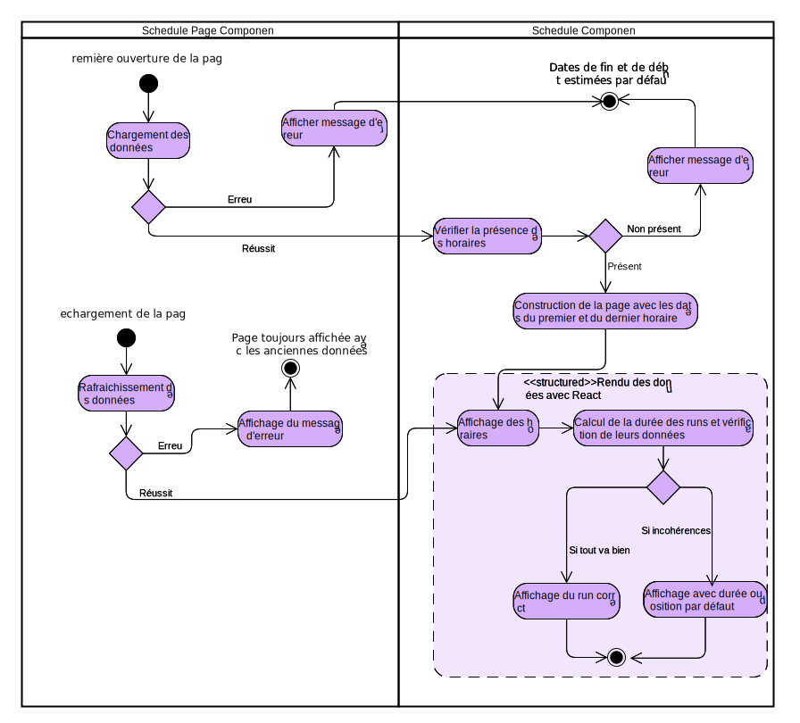
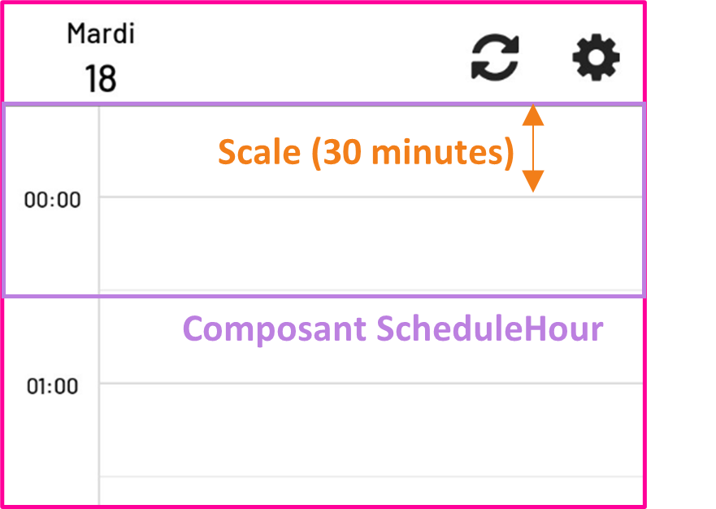
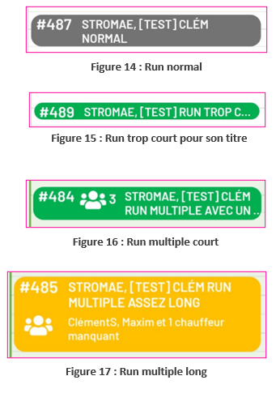

# Documentation de la page Horaires
## #1 Bases de l’organisation
La page des horaires est séparée en plusieurs composants. Le SchedulePageComponent gère l’affichage de toute la page, avec le header. C’est lui qui initie la récupération des données et les transmet au composant s’occupant uniquement de l’horaire, ScheduleComponent.
  
Voici un schéma d’activité expliquant globalement la manière dont les données sont traitées jusqu’à leur affichage :

## #2 Gestion du cache
Afin de récupérer et de transmettre les données à l’affichage sans avoir besoin de les recharger à chaque fois qu’elles doivent être affichées, une stratégie de cache est utilisée. Les composants UserRunsContainer et SchedulesContainer implémentent l’interface DataContainerInterface<T>, et utilisent donc le même système de gestion du cache que les autres pages et données que l’application. Cela leur permet de mettre à disposition chacun une liste des objets contenus dans le cache et une méthode pour rafraichir ces données. C’est donc aussi dans ces fichiers qu’est fait la requête à l’API et la conversion du JSON récupéré en objets utilisables plus facilement dans le reste de l’application.

## #3 Gestion de l'affichage de l'horaire
L’affichage se fait en deux étapes : d’abord, l’horaire se crée et définit ses variables essentielles dans le constructeur du composant « ScheduleComponent », puis il affiche les runs et les horaires à chaque rendu de React, dans un composant natif « ScrollView » permettant de scroller uniquement l’horaire et pas toute la page.

Pour son fonctionnement, il utilise trois variables de classe principales :
- **scale** : un chiffre représentant l’échelle de l’horaire et définissant combien de pixels doivent être affichés pour représenter 30 minutes.
- **startDate** : la date de début de l’horaire, dont l’heure doit toujours être exactement à minuit. Cette variable est définie lors du premier chargement.
- **hours** : un tableau contenant tous les composants d’heure « ScheduleHour » devant être affichés. Ces composants sont aussi définis lors du premier chargement.

### Création de l'horaire
Lors du premier chargement, plusieurs étapes s’effectuent dans l’ordre :
- Tri des donnés d’horaire par date de début
- Définition de **startDate** et du **nombre de jours** à afficher grâce aux dates du premier et du dernier horaire.
- Pour chaque heure de chaque jour à afficher, création d’un composant « ScheduleHour »,  en lui passant en paramètre la variable **scale** et une string représentant l’heure à afficher, puis ajout de ce composant dans la liste **hours**.

    

    Chaque composant « ScheduleHour » représente une heure du calendrier, et s’étend 30 minutes avant et 30 minutes après l’heure pile (ceci afin que le texte de l’heure puisse être centré). Leur position dans la vue scrollable est en « flex », ce qui signifie qu’elles s’empileront les unes par-dessus les autres, dans l’ordre, sans avoir besoin qu’on leur spécifie leur position par rapport au sommet du composant.
    

    

### Conversion d’une position en heure et inversement
Deux fonctions utilitaires permettent de convertir une position depuis le haut du composant en objet date, et inversement : parseScrollToDate(y)  et parseDateToScroll(date) Elles sont utilisées pour placer tous les autres éléments en position « absolute » sur l’horaire, et aussi pour interpréter la position actuelle de l’utilisateur.

### Fonctionnalités de scroll
Afin que l’utilisateur sache toujours quel jour du calendrier il est en train de regarder, une date est affichée sur la page principale « SchedulePageComponent », dans le header. 

Elle est changée dynamiquement en utilisant la propriété « onScroll » du composant « ScrollView » : à chaque fois que la page est scrollée, on met à jour la date grâce à la méthode parseScrollToDate, en faisant attention à changer le jour dès que l’heure affichée en haut de l’écran est plus tardive que 22h, afin que le jour affiché représente la majorité de l’écran.

Deux autres fonctionnalités servent aussi à améliorer l’expérience de l’utilisateur : 
-	La barre violette représentant l’heure actuelle, placée assez simplement en utilisant parseDateToScroll avec l’heure actuelle.
-	Le fait que la première position de l’horaire est centrée sur l’heure actuelle et non pas au début de l’horaire. Pour ce faire, la méthode « scrollTo » du composant « ScrollView » est utilisée une fois que le premier chargement est terminé.

## #4 Affichage des runs
L’affichage d’un run est constitué de deux parties importantes :
- Le calcul de sa position et de sa hauteur, qui doit prendre en compte la possibilité d’erreurs dans les données et se fait dans le composant « ScheduleComponent »
- L’affichage dynamique par rapport à la taille et aux spécificités du run, qui se fait dans le composant « ScheduleRunComponent » représentant un run.

### Calcul de la position et de la hauteur
Il y a 4 dates disponibles dans un run pour définir ses dates de début et de fin : « begin_at » et « finished_at » pour les dates planifiées, « start_at » et « end_at » pour ses dates enregistrées.
- Avant de commencer les calculs et les vérifications, on définit des variables start et end. Si « start_at » ou « end_at » sont déjà définies, ces valeurs sont utilisées, sinon ce seront les valeurs planifiées. 
- Pour calculer la position de départ, il suffit de réutiliser parseDateToScroll sur start. Pour la hauteur, il faut faire la différence en heure entre start et end.
- Il y a ensuite trois vérifications pour assurer la robustesse du système :

    - Si le run démarre après la date de fin planifiée ou s’il est trop petit car il a démarré trop tard, la hauteur est définie par rapport à la durée planifiée (« begin_at » et « finished_at »)
    - Si, après ça, la hauteur est toujours plus petite que zéro ou n’est pas un nombre, une hauteur de 1h30 est définie par défaut.
    - Si la position de départ n’est pas un nombre (dans le cas extrême où le run n’aurait aucune date de départ), le run est placé en haut du calendrier simplement afin d’éviter que la page ne plante à cause d’une erreur.

### Affichage conditionnel
L’affichage d’un run doit s’adapter à 4 états différents :

    
    
 Normal : rien de spécial. Il faut que la couleur du run corresponde à son statut.   Trop court : si le texte dépasse la hauteur du run, il faut qu’il se termine par « … ». Pour ce faire, la propriété « numberOfLines » du composant natif « Text » est utilisée, en divisant la hauteur du run par la hauteur d’une ligne pour en obtenir le nombre    Multiple court : si le run utilise plusieurs véhicules et plusieurs chauffeurs, une icône le signale à l’utilisateur et indique le nombre de véhicules. Il faut alors aussi adapter la largeur du texte.    Multiple long : si c’est un run multiple et qu’il est assez long pour pouvoir afficher 4 lignes de texte, l’icône spéciale passe en dessous de l’id, et un texte indique les noms des autres chauffeurs du run à l’utilisateur.

